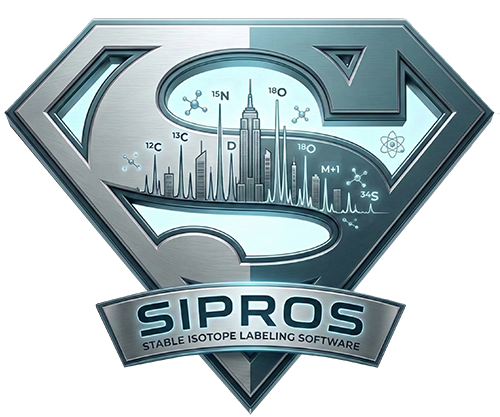

<p align="center">
  
</p>

## Sipros5 Setup Guide

### 1. Create Conda Environment

```bash
conda install bioconda::sipros
```

### 2. Download Raw Files

```bash
mkdir raw
# Download raw file with 1% 13C
wget ftp://ftp.pride.ebi.ac.uk/pride/data/archive/2024/06/PXD041414/Pan_062822_X1iso5.raw -P raw
# Download raw file with 50% 13C  
wget ftp://ftp.pride.ebi.ac.uk/pride/data/archive/2024/06/PXD041414/Pan_052322_X13.raw -P raw
```

### 3. Download E. coli Protein FASTA Sequence

```bash
wget https://ftp.uniprot.org/pub/databases/uniprot/knowledgebase/reference_proteomes/Bacteria/UP000000625/UP000000625_83333.fasta.gz
gunzip UP000000625_83333.fasta.gz -c > Ecoli.fasta
```

### 4. Example Commands

#### Regular Search

```bash
siproswf -i raw/Pan_062822_X1iso5.raw -f Ecoli.fasta -o regular_output
```

#### Extract protein sequences identified in Regular search

- This step is particularly useful when your protein FASTA is large (for example, several GB in metaproteomics studies). The `regular_output/protein.tsv` file can be replaced with results from other proteomics search engines (e.g., FragPipe, MaxQuant, or Proteome Discoverer) as long as the first column contains the protein identifier.
- If you are working with a small FASTA, you can skip this extraction step and use the original FASTA for the label search.

```bash
extractPro Ecoli.fasta regular_output/protein.tsv db.faa
```

#### Label Search

```bash
siproswf -i raw -f db.faa -e C13 -o sip_output
```

#### Label Search with negative control using unlabeled sample

```bash
siproswf -i raw -f db.faa -e C13 --negative_control Pan_062822_X1iso5 -o sip2_output
```

#### Search chemistry and defaults

The Regular and SIP search profiles, residue/PTM chemistry, isotope
distributions, digestion rules, and default tolerances live in
`sipros/src/proNovoConfig.cpp`. Runtime inputs such as the FASTA database,
mass-tolerance overrides, SIP isotope, abundance range, and abundance step are
passed explicitly on the command line. Missing SIP controls are rejected.

Regular FASTA search enables oxidation (`~`, M) and deamidation (`!`, N/Q) by
default, with at most three variable PTMs per peptide. Use a repeatable
`--ptm` option to replace that default set with compiled PTMs, and
`--max-ptm-count` to change the per-peptide limit. The `default` selector adds
the Regular defaults to an explicit list; `none` disables all variable PTMs;
and `all` selects every compatible variable PTM. Descriptive names avoid shell
quoting problems with symbols such as `>`, `&`, and `$`.

Carbamidomethyl-Cys is the default fixed PTM. A repeatable `--fixed-ptm`
option replaces the fixed default set: use `--fixed-ptm none` for natural Cys,
or `--fixed-ptm carbamidomethyl` to open it explicitly.

```bash
# Defaults: oxidation + deamidation
siproswf -i sample.h5 -f proteins.fasta -o regular_output

# Defaults plus phosphorylation and acetylation
siproswf -i sample.h5 -f proteins.fasta -o ptm_output \
  --ptm default --ptm phosphorylation --ptm acetylation \
  --max-ptm-count 3

# Natural Cys: close the default fixed carbamidomethyl PTM
siproswf -i sample.h5 -f proteins.fasta -o natural_cys_output \
  --fixed-ptm none

# Show every compiled selector, token, and site
tools/sipros search-fasta --list-ptms
```

The restored catalog contains phosphorylation and its two deterministic
neutral-loss forms, acetylation, mono/di/trimethylation, S-nitrosylation,
nitration, and beta-methylthiolation in addition to the two defaults. IAA
carbamidomethylation uses the `/` token when natural Cys is selected; it is
excluded from variable search while the equivalent fixed PTM is open.
FragPipe bracketed absolute or delta modification masses are translated through
this same catalog before theoretical or experimental spectrum masses are
calculated.

Elemental formulas also retain isotope-source provenance. Amino-acid atoms are
`Biosynthetic` and follow the selected SIP abundance; carbamidomethyl atoms are
`ReagentNatural`, and peptide-terminal H2O is `DigestionSolvent`. Both natural
sources always use the natural isotope distribution of the real CHONPS element.
Generated spectra libraries record this contract in `chemistry_profile_id`, and
`search-spectra` rejects libraries made with a different or legacy chemistry.
FASTA precursor estimates sum the expected exact isotope-mass shifts from all
source-aware CHONPS atoms, divide by the expected nominal-neutron shift to get
a peptide-specific spacing, and round the combined nominal shift once. The
same composition-weighted spacing defines that peptide's configured precursor
isotope windows; FASTA assignment does not fall back to a global target-isotope
spacing.

### 5. Output Files

- `SIP_filtered_psms.tsv`: PSMs from all samples that pass the unlabeled negative-control filter (1% FDR), with SIP element labeling percentages (`MS1IsotopicAbundances`, `MS2IsotopicAbundances`). `isotopicPeakNumbers` is the raw number of extracted MS1 isotope peaks. `MS1IsotopeFitScore` is the theoretical-envelope coverage from `0` to `1`, set to `0` unless at least two compatible peaks are present; scores of at least `0.02` pass the MS1 abundance-fit validity threshold. MS1IsotopicAbundances are more sensitive; MS2IsotopicAbundances are more accurate.
- `protein_with_SIP_filtered_PSM.tsv`: maps unlabeled negative-control filtered PSMs to the proteins identified in each sample.
- For each raw-file subdirectory:
  - `<sample>.h5`: Raxport scan data.
  - `<sample>_target.pin`, `<sample>_decoy.pin`: target and decoy search intermediates.
  - `<sample>_target_psms.tsv`, `<sample>_decoy_psms.tsv`: Aerith reranked score tables.
  - `<sample>_filtered_psms.tsv`: Aerith 1% FDR PSMs with original search and RT features.
  - `psm.tsv`: FragPipe/Philosopher-style accepted PSM report with precursor
    intensity, assigned modifications, search class, protein coordinates, and
    FASTA annotations.
  - `protein.tsv`, `protein.fas`: Aerith's per-sample picked-FDR/razor protein report and identified FASTA entries.
  - `*_filtered_psms.tsv`: PSMs passing 1% FDR decoy filtering with `isotopicPeakNumbers`, `MS1IsotopeFitScore`, `MS1IsotopicAbundances`, `MS2IsotopicAbundances`, and, for regular FASTA search, `unweighted_spectral_entropy`, `delta_RT_loess`, `delta_RT_loess_real`, and `pred_RT_real_units`.
- At the workflow root, `protein.tsv` and `protein.fas` contain the combined cross-sample protein assembly. Aerith performs this directly from its in-memory scored PSMs, without pepXML, ProteinProphet, Philosopher workspaces, or `.meta` intermediates.
- FASTA workflows pass the original target FASTA and generated decoy FASTA to
  Aerith separately; the workflow does not create `targetDecoy.faa`. SIP
  spectra-search mode runs Aerith filtering only and produces the per-sample
  `*_filtered_psms.tsv` files without protein assembly outputs.

The workflow-root `aerith.log` includes a protein-assembly optimization table
merged with filtering timing. Every stage reports wall time, CPU time, and
observed speedup. The results section reports distinct naked peptide sequences,
distinct modified peptide forms, PTM peptide forms, and PTM-bearing PSMs at the
configured FDR.

Aerith converts `log10_precursorIntensities` back to linear PSM intensity and
uses Philosopher's top-three peptide-ion rule for total, unique, and razor
protein intensity. `protein_with_PSM.tsv` includes a
`<sample>_ProteinAbundance` column sourced from each sample's razor intensity.

### Native predicted-spectrum entropy in Aerith

Aerith can predict DIA-NN fragment spectra directly through LibTorch and add
MSBooster-compatible `unweighted_spectral_entropy` to SVM rescoring. The
renamed DIA-NN 2.6.1 fragmentation checkpoint is
`tools/diann-2.6.1-fragmentation.pt`; the exact DIA-NN token dictionary is
compiled into Aerith.
The implementation keeps DIA-NN's predicted top fragments, applies each
Raxport scan's MS2 m/z window, matches experimental peaks at 20 ppm by default,
and computes the entropy similarity when at least two predicted ions have
experimental matches.

Build Sipros and dynamic-LibTorch Aerith from the `sipros5` environment with:

```bash
./make.sh buildConda
```

The Aerith Conda build requires PyTorch/LibTorch 2.12.1 or newer. For the GPU build, install the matching CUDA 12.9
PyTorch and CUDA development packages shown at the top of `make.sh`.

`make.sh` obtains `Torch_DIR` from the environment's Python package and checks
that Aerith dynamically resolves `libtorch` and `libc10`; LibTorch is not
statically embedded in Aerith.

Aerith automatically uses CUDA for DIA-NN spectrum and RT prediction when a
CUDA-enabled PyTorch installation and an accessible GPU are available. If CUDA
is unavailable or initialization/inference fails, Aerith retries prediction on
the CPU. The regular FASTA workflow does not override `CUDA_VISIBLE_DEVICES`,
so it honors GPU visibility assigned by the user, container, or scheduler. The
selected device or fallback reason is written to the workflow log. The timing
table reports the exact DIA-NN model-inference wall and CPU times with `(GPU)`
or `(CPU)` in the row label, in addition to the complete feature-stage time.

Pass one Raxport HDF5 file for every input sample, in the same order as the PIN
pairs:

```bash
build/conda/bin/aerith \
  --target-pin sample_target.pin \
  --decoy-pin sample_decoy.pin \
  --spectra sample.h5 \
  --output-prefix results/sample
```

Use `--spectrum-model` to override the checkpoint file and `--fragment-ppm` to
change the matching tolerance. A build configured with
`-DAERITH_ENABLE_TORCH=OFF` remains usable for filtering without `--spectra`.

The complete regular FASTA workflow supplies each sample's Raxport HDF5 file
to Aerith automatically, so no extra flag is needed:

```bash
siproswf -i raw -f Ecoli.fasta -t 40 -o regular_output
```

This automatic predicted-spectrum feature is limited to regular FASTA search;
SIP and search-spectra workflows keep their existing feature sets. The DIA-NN
license notice available for the checkpoint is reproduced in `LICENSE`;
review the version-specific terms before redistributing the checkpoint or a
package containing it.

When this feature is enabled, Aerith's timing report includes `Predict spectra
and compute entropy`. This measures the complete feature-generation stage,
including unique peptide-charge preparation, Torch inference, HDF5 loading,
fragment matching, and entropy calculation.

### Native DIA-NN delta-RT in Aerith

Aerith also loads the renamed DIA-NN 2.6.1 `models/rt.d0.pt` checkpoint from
`tools/diann-2.6.1-retention-time.pt`. It predicts each unique modified peptide
sequence once (RT is charge-independent in this graph), converts the raw model
output to DIA-NN iRT, and fits a separate monotonic robust-LOESS calibration
for each input sample. It computes three MSBooster-compatible values:

- `delta_RT_loess`: absolute predicted-iRT error after mapping observed RT to
  iRT. This is the only DIA-NN RT value used for SVM training and shown in the
  SVM feature-weight report.
- `delta_RT_loess_real`: absolute error in the sample's RT units. This is an
  output-only diagnostic written immediately after `retentiontime`.
- `pred_RT_real_units`: predicted iRT mapped back to the sample's RT units.
  This is also output-only and follows `delta_RT_loess_real`.

The calibration uses up to 5,000 unique precursors ranked only by `WDPscores`:
the best 4,000 globally plus up to 20 additional nonduplicate precursors from
each of 50 equal-width observed-RT bins. Sparse bins are backfilled with the
best remaining WDP candidates. Target/decoy labels, `log10_evalue`, and
`hyperscore` are not consulted.
Both Sipros symbol modifications and FragPipe/MSBooster numeric mass notation
are accepted. Use `--rt-model` to override the checkpoint. The timing report's
`Predict RT and compute delta-RT` row includes peptide deduplication, Torch
inference, bandwidth selection, LOESS calibration, inverse mapping, and all
three value calculations. When the DIA-NN RT feature is generated,
Aerith skips its legacy nested chemical RT model and does not add the redundant
`sqrtAbsDeltaRT` feature. Use `--no-predicted-rt` to disable DIA-NN RT and use
the legacy Aerith RT model instead.

## Sipros5 Setup Guide (set the python and binary by yourself)

### 1. Create Conda Environment

```bash
conda create -n sipros5 lxml pandas seqkit python=3.12 -c bioconda -c conda-forge
conda activate sipros5
```

### 2. Download Sipros5 Release

```bash
wget https://github.com/xyz1396/sipros5/releases/download/5.0.1/siprosRelease.zip
unzip siprosRelease.zip
chmod +x sipros/tools/* sipros/script33/extractPro.sh
```

### 3. Example Commands

#### Regular Search

```bash
python sipros/script33/main.py -i raw/Pan_062822_X1iso5.raw -f Ecoli.fasta -o regular_output
```

#### Extract protein sequences identified in Regular search

```bash
sipros/script33/extractPro.sh Ecoli.fasta regular_output/protein.tsv db.faa
```

#### Label Search

```bash
python sipros/script33/main.py -i raw -f db.faa -e C13 -o sip_output
```

#### Label Search with negative control using unlabeled sample

```bash
python sipros/script33/main.py -i raw -f db.faa -e C13 --negative_control Pan_062822_X1iso5 -o sip2_output
```

### 6. Citations

1. Xiong, Y., Mueller, R. S., Feng, S., Guo, X., & Pan, C. (2024). [Proteomic stable isotope probing with an upgraded Sipros algorithm for improved identification and quantification of isotopically labeled proteins](https://doi.org/10.1186/s40168-024-01866-1). *Microbiome*, 12, 148.
2. Li, J., Xiong, Y., Feng, S., Pan, C., & Guo, X. (2024). [CloudProteoAnalyzer: scalable processing of big data from proteomics using cloud computing](https://doi.org/10.1093/bioadv/vbae024). *Bioinformatics Advances*, 4(1), vbae024.
3. Guo, X., Li, Z., Yao, Q., Mueller, R. S., Eng, J. K., Tabb, D. L., Hervey IV, W. J., & Pan, C. (2018). [Sipros Ensemble improves database searching and filtering for complex metaproteomics](https://doi.org/10.1093/bioinformatics/btx601). *Bioinformatics*, 34(5), 795-802.
4. Wang, Y., Ahn, T.-H., Li, Z., & Pan, C. (2013). [Sipros/ProRata: a versatile informatics system for quantitative community proteomics](https://doi.org/10.1093/bioinformatics/btt329). *Bioinformatics*, 29(16), 2064-2065.
5. Pan, C., Kora, G., McDonald, W. H., Tabb, D. L., VerBerkmoes, N. C., Hurst, G. B., Pelletier, D. A., Samatova, N. F., & Hettich, R. L. (2006). [ProRata: a quantitative proteomics program for accurate protein abundance ratio estimation with confidence interval evaluation](https://doi.org/10.1021/ac060654b). *Analytical Chemistry*, 78(20), 7121-7131.
